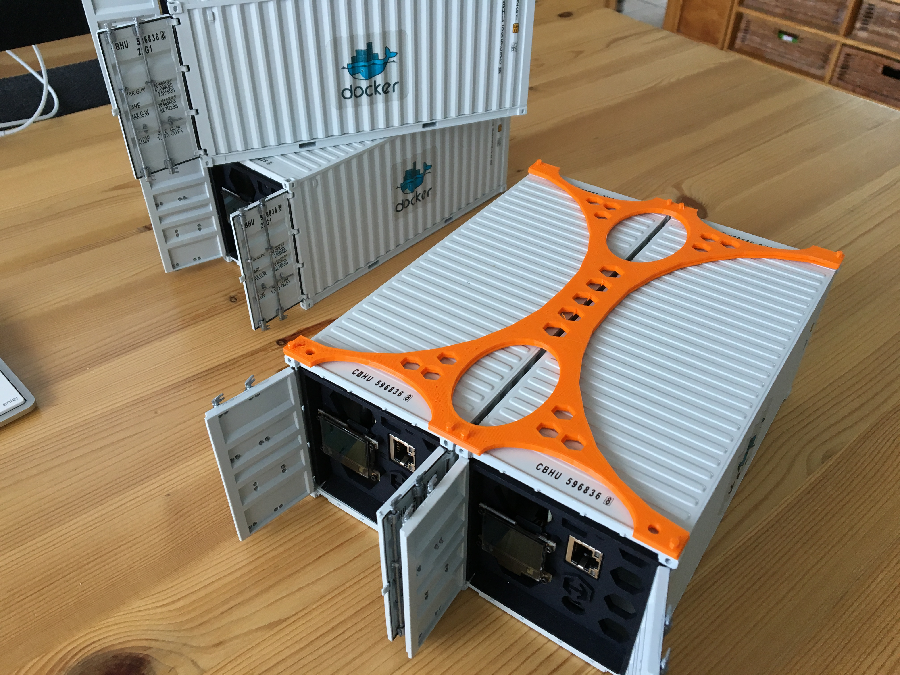
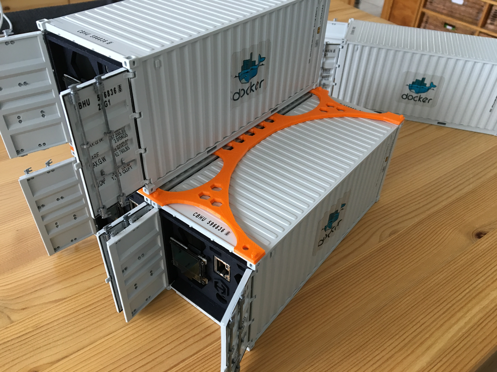
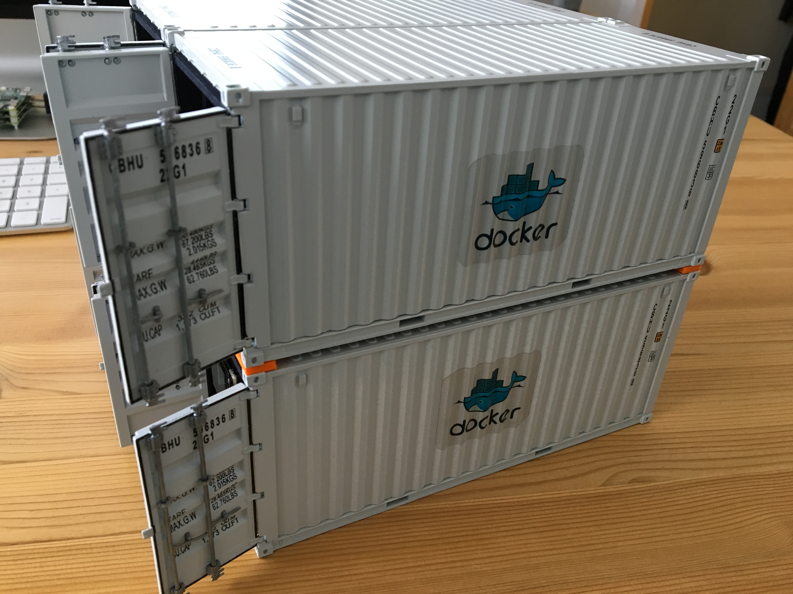
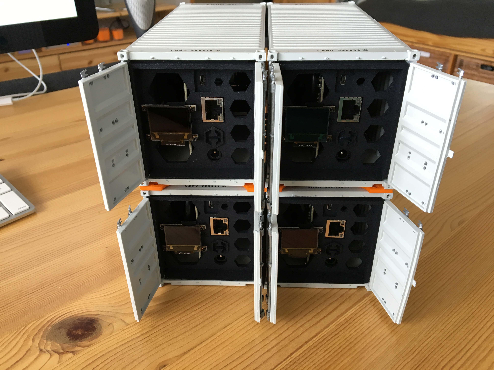

# DC2 Stacker

The Kickstarter backers that have bought the DC2 (a stack of 4 containers) might have a hard time to get them stacked.
This is because there's no lock to get the containers nicely stacked. To make sure they keep "stacked" on top of each other I created a small frame called the "DC2 Stacker" :-)

All you need to do is print (a 3D printer that is, not you're regular printer) the [STL file](./sources/dc2_stacker.stl) three (3x) times. One would be the base layer, and the two other layers should be glued together (with superglue) to form the mid section.

The end result should look like this;

## The two layers are glued together, and should be placed on top of the fist two containers

## The next layer of containers should fit in nicely

## The end result, now the containers won't fall off the stack

## STL file

