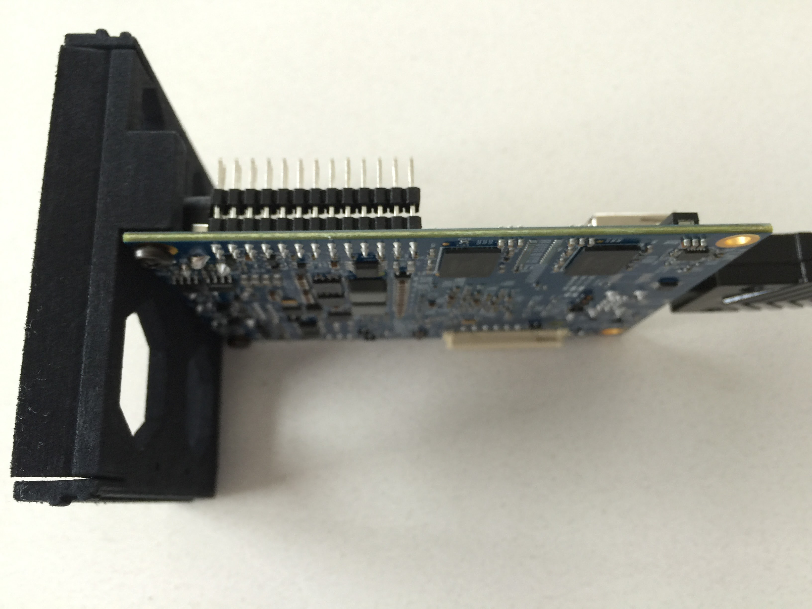
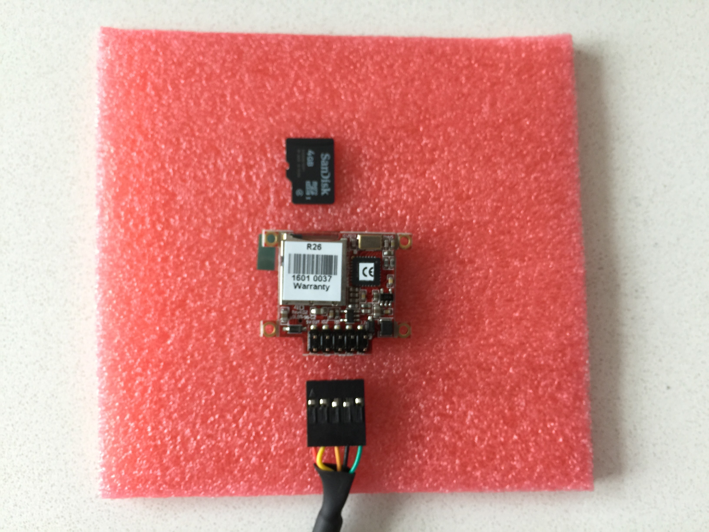

# DC2 Setup
1. Power up your DC2
2. Find the DC2 on your network
3. Configure the DC2
4. Add the DC2 as a docker machine
5. Assemble the DC2

## 1. Power up your DC2

1.0 Let's make sure your MinnowBoard boots up and get it all setup while we can easily see the lights etc. before putting it in the container. If you have more than one DC2, let's set them up separately.

1.1 Set your MinnowBoard on the pink foam to protect it from shorting out.

1.2 Connect your USB drive to the MinnowBoard. Plug it into the USB socket that is blue.

1.3 Connect your MinnowBoard with an ethernet cable to the same network your PC that you will use to setup the DC2 is connected to.

1.4 OPTIONALLY connect your MinnowBoard to a display with a micro HDMI connector.

1.5 The last connection will be connecting your MinnowBoard to power.

1.6 You should see the USB drive light flicker. If you have an display connected, you should see the the boot sequence scroll across.


## 2. Find the DC2 on your network 

2.1. Make sure you have Bonjour / mDNS

When you connect your DC2 to your network, it will be using DHCP to get an IP address. To work with the DC2 from other machines, we will need to find out where it is. The DC2 will default to having the '''dc2.local''' hostname which will be broadcast with mDNS aka Bonjour. If you have a Mac or Windows 10 machine, you are good to go. If you have an earlier version of Windows, you will need to install [Bonjour Services](https://support.apple.com/kb/DL999?viewlocale=en_US&locale=en_US), If you are on a linux box, you can install [Avahi](https://wiki.archlinux.org/index.php/Avahi).

2.2 If you have more than one DC2, then set them up one at a time so you can change the host names to differentiate between them.

2.3. Check you can connect to your DC2

Open up http://DC2.local:8765 with your browser -- this should return the configuration information from your DC2. 
It can take 40 seconds for the DC2 to boot, and 30 seconds for the dc2-node script to run and Bonjour to have completed its broadcast so that loading the web page to work. You should see something like this:

```
{
"latestVersion": "1.0.4",
"version": "1.0.4",
"hostname": "dc2",
"ip": "a.b.c.d",
"MAC": "ff:ff:ff:ff:ff:ff",
"callHomeResponse": 200
}
```

where `a.b.c.d` is the IP address of your DC2 and `ff:ff:ff:ff:ff:ff` is the MAC address of your DC2 ethernet port.

## 3. Configure the DC2

3.1 Check that you can SSH into your DC2. `jack` is the preconfifured username

`$ ssh jack@dc2.local`

enter `hardtware` when prompted for the password

3.2 Change your password

`$ passwd`

Enter `hardtware` for the old password, and then enter your new password

3.3 If you don't have an ssh key, create one *link to directions*

3.4 Copy your SSH public key to your DC2.

First `exit` your SSH session with your DC2. 

If your SSH public key is at `~/.ssh/id_rsa.pub` then from your machine:

`ssh jack@dc2.local "cat >> .ssh/authorized_keys" < ~/.ssh/id_rsa.pub`

enter your new password when prompted

You should now be able to `ssh jack@dc2.local` and not be prompted for a password.

3.5 If you are not in the `America/Los Angeles` timezone you can change it with `sudo dpkg-reconfigure tzdata`

3.6 If you want to change the locale, follow directions at https://help.ubuntu.com/community/Locale

3.7 If you have more than one DC2, change your hostname by replacing `dc2` to a new hostname unique on your network (eg. dc2a, dc2b, dc2c) in the 

`/etc/hostname` and `/etc/hosts` files

with the editor of your choice. Then restart `hostname` and `avahi` with

`sudo service hostname restart`
`sudo /etc/init.d/avahi-daemon restart`

NOTE: Everwhere you see `dc2` below, change that to the new hostname you have given your DC2.

## 4. Setup DC2 as a Docker Machine

4.1 Make sure you have the [Docker Toolbox](https://www.docker.com/products/docker-toolbox) intalled on your computer.

4.2 Find the IP address of your DC2

`ping dc2.local`

Substitute `a.b.c.d` in the following commands with your DC2's IP address

4.3 Check that you can use SSH against your IP address

`ssh dc2@a.b.c.d`

If you had previously used SSH against that IP address, your will likely get an error and you will need to update your known_hosts file.

4.4 Setup the DC2 as a generic machine

`docker-machine create --driver generic --generic-ssh-user=jack --generic-ip-address=a.b.c.d dc2`

This command takes a while as it will be updating the DC2. It will create add your DC2 as a machine to run containers in. Sometimes docker-machine emits an error about certs

4.4 Check the status of your DC2 docker machine

`docker-machine status dc2`

4.5 Setup the DC2 as your docker machine

`docker-machine env dc2` will show you how to setup the envirnment to run commands against your DC2

4.5 Run the hello-world container

`docker run hello-world`

You should see "Hello from Docker". You now have a functining Desktop Computer Container!

4.6 Shutting down your DC2. Make sure you properly shutdown your DC2 so that the file system does not get corrupted. If it does, you will need to connect a monitor and keyboard to fix the errors on boot.

`ssh jack@dc2.local`
`sudo shutdown -h now`

**put assembly down here!**

Success! Disconnect power, ethernet and HDMI (if connected) and finish assembly in 1.4


`WRITE SAME failed. Manually zeroing.`


## 5. DC2 Assembly

5.1 Connect the MinnowBoard Turbot to the faceplate.

5.1.1 Get a #1 (or #2 if need be) philips head screwdriver and screw the 2 M3 hilips screws each in a few turns. You want the screws to go in from the left side if you are looking at the front of the faceplate. We are doing this to loosen the threads as the faceplate threads are 3D printed.


5.1.2 Take out the screws, set the MinnowBoard Turbot on the faceplate, and screw the screws back in. Tighten enough that the MinnowBoard Turbot does not wobble around on the faceplate. If you have a SilverJaw Lure, you can first mount it to the MinnowBoard Turbot placing the spacers between the two boards, then screw the screws into the faceplate, and then screw the screws into the standoff at the other end of the boards.



With SilverJaw 


5.2 Connnect the USB drive to the MinnowBoard if it is not connected.

5.3 If you have an OLED you need to connect it before installing the MinnowBoard Turbot into the container.

5.3.1 Just as we did with the screws for mounting the MinnowBoard, we need to clean out the threads for the OLED mount. Screw the M1.6 screws into the OLED mounting locations with the supplied allen wrent, and then take them back out.


5.3.2 Insert the memory card into the OLED. This image also shows how the cable will be connected.



5.3.3 Mount the OLED with the 4 M1.6 hex head screws.


5.3.4 Connect the cable from the USB 2.0 connector to the OLED. Make sure you connect per the image and then coil the cable as indicated. You can use the twist tie from the power supply to hold the OLED cable.


Full Assembly


5.3.5 NOTE: we are still working on software to drive the OLED.

5.4 Slide the assembled MinnoBoard and faceplate into the container. It should click a little when fully installed.

5.6 Reconnect ethernet and power and enjoy your DC2!


## 6. FAQ

6.1 Q: Something is not working?

A: Check the FAQ below. If not answered, file an issue at https://github.com/hardtware/DC2/issues

6.2 Q: What is the CR1225 battery for?

A: It is a spare battery. Your MinnowBoard Turbot should have a CR1225 battery in it already.


